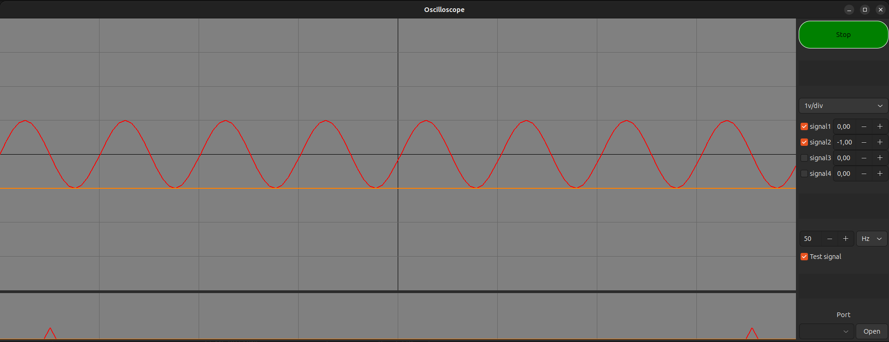

<h1>
    OSCILLOSCOPE
</h1>

    

https://www.youtube.com/playlist?list=PLEoHO-IssPPAtG2c3IKp_-9pR1gyZFhW2

## DESCRIPTION
This project born from the need to observe the voltage signals and analyze their spectrums in real time, with the advantage that is economic and easy to use on OS linux.

It currently works with four signals and anyone can use it.
Simply send "#@%x@%x@%x@%x\n" via the serial-port.

If you want to use it, download it from the link below.